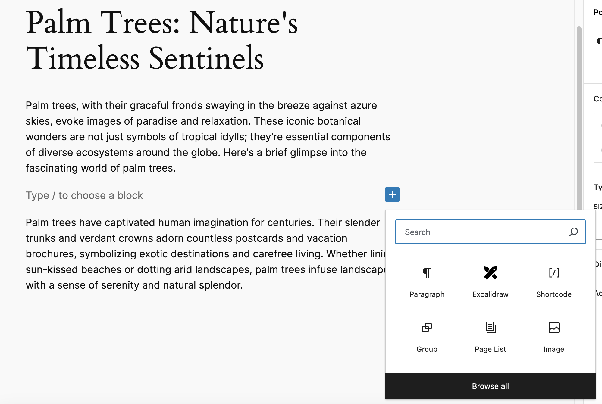
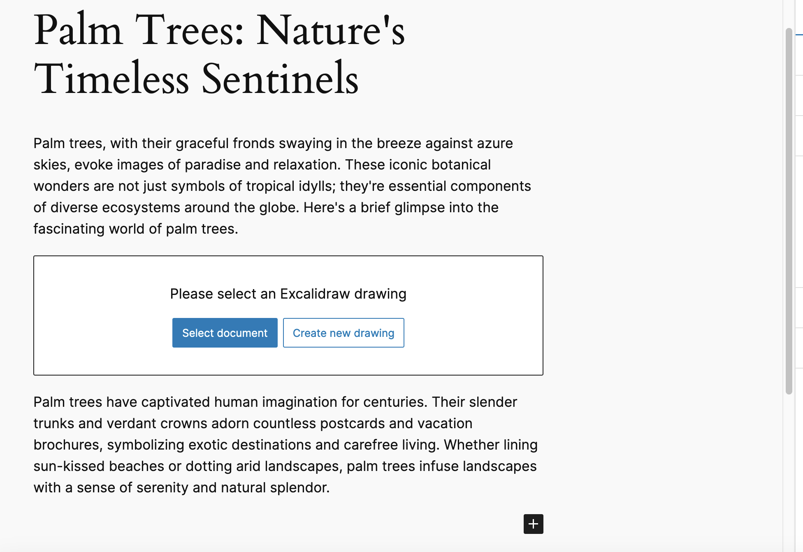
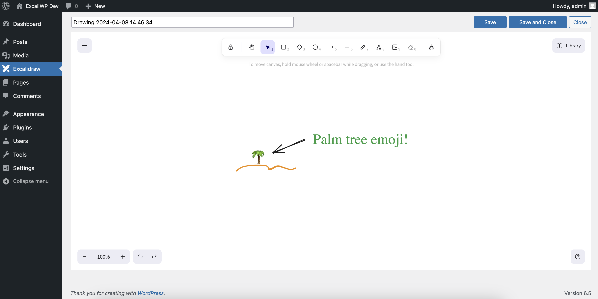
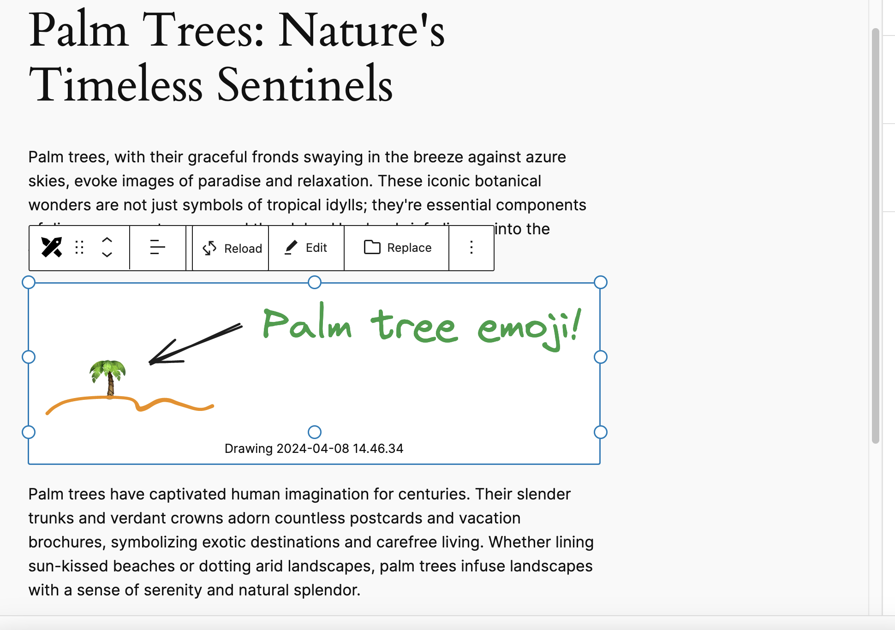

# WordPress plugin for Excalidraw

This plugin allows users to create and edit Excalidraw documents directly in the WordPress backend. Using an Excalidraw block for Gutenberg, the drawing can be easily inserted into posts. On the frontend, the drawings are displayed as SVG files, reducing page load time and making images responsive.

## Adding a new drawing

Is as simple as adding a new block in the Gutenberg editor.

User can select an existing document or create a new one.

New drawings can be created directly in the browser and saved automatically to WordPress.

The size and alignment can be adjusted to find the best fit in the text flow.

## Acknowledgements

- Thanks for [Excalidraw](https://excalidraw.com), the awesome sketching tool
- Thanks for WordPress [Plugin Boilerplate](https://github.com/DevinVinson/WordPress-Plugin-Boilerplate)
